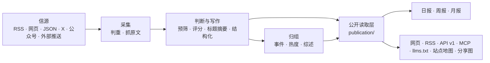

# 架构



## 三个进程

| 进程 | 位置 | 做什么 |
|---|---|---|
| api | `apps/api/` | Fastify。网站自用接口（`/api/site/`）、公开 API（`/api/v1/`）、RSS、MCP、后台接口、图片代理、分享图 |
| worker | `apps/worker/` | pg-boss 任务队列和定时任务：抓信源、调模型、归组、热度、日报、告警、清理 |
| web | `apps/web/` | React Router 服务端渲染的网页。只通过 HTTP 读 api，不碰数据库 |

业务代码都在 `packages/backend/`，前后端共用的类型和常量在 `packages/contracts/`，行业相关的一切在 `industry/`。

## 几条不变的规则

- **一个公开读取层**：网页、RSS、API、MCP、站点地图、分享图读的都是 `packages/backend/src/publication/`，所以各个出口看到的内容一致。新增公开出口也从这里读。
- **页面不调模型**：读者打开页面只读数据库里已经有的结果；模型只在 worker 的任务里调用。
- **花钱的请求有回执**：每个付费请求（模型、X、公众号、Jina）先记一张回执，拿到结果先存再用。进程重启、任务重试时，复用已经付过钱的结果，不重复花钱（`providers/receipts.ts`）。结果不明的回执超过 30 分钟后自动放行一次；因它停在失败状态的文章会重新入队，继续未完成的正文提取或分析。再次结果不明时，由管理员在“运行”页核对后放行。
- **预算熔断**：每个付费服务有每分钟、每小时、每天的上限，超过就暂停（后台“设置 → 预算”）。
- **安全阀**：`COLLECT_ENABLED`、`MODEL_CALLS_ENABLED`、`FEISHU_CONTENT_PUSH_ENABLED`、`FEISHU_INTERNAL_ENABLED`、`INDEXNOW_SUBMIT_ENABLED` 只决定“发不发出去”，不决定走哪套逻辑。开发和测试时关掉。
- **公开内容匿名**：管理员和访客看到的一样；读者的收藏、已读存在浏览器里。后台只允许管理员。
- **旧文不刷屏**：发现时已发布超过 48 小时的资料、新信源的存量、回灌的推送，按原文时间归档，不进“今天”、不推送。
- **来源可追溯**：每条精选都链接原文；站内是否显示全文由信源的 `site_fulltext` 决定，默认只显示摘要。

## 目录

| 位置 | 内容 |
|---|---|
| `industry/` | 行业包：站名文案、分类标签、主题、示范信源、提示词、门槛、品牌、条款页 |
| `packages/backend/src/sources/` | 六种信源的读取器，抓取调度（`collect.ts`） |
| `packages/backend/src/content/` | 资料入库、判重、正文提取和清洗 |
| `packages/backend/src/editorial/` | 判断与写作：`analyze.ts`（流程）、`prompts.ts`（读提示词）、`models.ts`（每一步用哪个模型） |
| `packages/backend/src/events/` | 事件归组、热度、事件综述 |
| `packages/backend/src/publication/` | 公开读取层 |
| `packages/backend/src/reports/` | 日报、周报、月报 |
| `packages/backend/src/providers/` | 模型、向量、X、公众号、Jina 的调用，回执与预算 |
| `packages/backend/src/notify/` | 飞书推送 |
| `packages/backend/src/operations/` | 告警、备份、清理、IndexNow |
| `packages/backend/src/admin/` | 后台接口 |
| `packages/backend/src/leaderboard/`、`monitor/` | 模型榜、Codex 重置监控（见 [模型榜与 Codex 重置监控](leaderboard.md)） |
| `apps/web/app/routes/` | 每个页面一个文件，`routes.ts` 是路由表 |
| `database/migrations/` | 数据库迁移，按编号顺序执行 |
| `scripts/` | 初始化、迁移、种子数据、评测、检查脚本 |
| `tests/` | 后端测试（需要一个名字以 `_test` 或 `_ci` 结尾的空库） |

## 对外出口

| 地址 | 内容 |
|---|---|
| `/` `/all` `/hot` `/topics` `/daily` `/weekly` `/monthly` | 精选、全部动态、热门事件、主题、日报周报月报 |
| `/feed.xml` `/feed/all.xml` `/feed/full.xml` `/feed/daily.xml` | RSS：精选、全部、全文、日报 |
| `/api/v1/` | 公开 API，文档在 `/openapi-v1.json`，说明页在 `/agent` |
| `/api/mcp` | MCP 服务，工具名前缀是 `industry/site.ts` 的 `mcpPrefix` |
| `/llms.txt` `/sitemap.xml` `/robots.txt` | 给大模型和搜索引擎的说明 |
| `/admin` | 后台 |

## 测试

```bash
npm run typecheck
createdb myhot_test
DATABASE_URL=postgres://127.0.0.1:5432/myhot_test node scripts/migrate.ts
DATABASE_URL=postgres://127.0.0.1:5432/myhot_test npm test
npm run build -w @aihot/web && node --test apps/web/tests/*.test.ts
```

测试不访问任何外部服务：模型和付费接口都由本地假服务回答。
