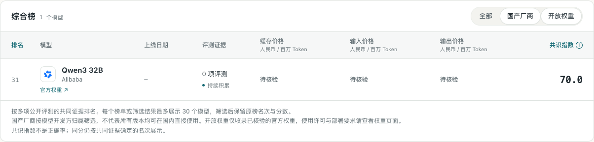

# 模型榜与 Codex 重置监控

这两个模块只对 AI 行业有意义。别的行业在 `industry/features.ts` 里关掉即可（见 [把它改成你的行业](customize.md#6-只对-ai-有意义的两个模块industryfeaturests)）。

## 模型榜（`/leaderboard`）

把多家公开评测（Artificial Analysis、LMArena、LiveBench、Epoch、EQ-Bench、Vals 等）的成绩放在一起，算出一个尽量不和已知成绩冲突的完整排名，另有编程、推理、知识等分类榜。方法对读者公开：

- `/leaderboard/rules`：排名怎么算（共识方法 v15，加权不完整 Kemeny 排序）。
- `/leaderboard/sources`：每个评测来源测什么、状态如何、是否参与排名。

**筛选**：综合榜和各分类榜均可组合选择“国产厂商”“开放权重”。先从完整排名中筛选，再取前 30 个；原榜名次与分数不变。国产厂商按开发方归属判断，不保证每个版本都能在国内直接使用；开放权重须有明确型号对应的官方权重仓库，也不代表无条件商用。表格提供官方权重链接供读者查看许可和部署要求。

官方权重对应关系维护在 `packages/backend/src/leaderboard/model-weights.json`，只登记核验过的精确型号；厂商归属规则在同目录的 `access.ts`。新模型未登记时不会自动认定为开放权重，无需重新计算排名即可更新这些展示信息。

下面用本地构造的数据演示组合筛选，不代表模型的实际排名和评测结果：



**更新**：每天 02:05、08:05、14:05、20:05 检查一遍所有上游。某个来源抓取失败时沿用它上一份快照；只有证据真的变了，才发布新的一轮。新装好的站在 worker 第一次启动时会立刻算一轮。

**需要的 key**：

- `ARTIFICIAL_ANALYSIS_API_KEY`：Artificial Analysis 这一项要它自己的 key。没有时这一项不参与，它的份额空着，不转给别的评测，所以榜单会和 AIHOT 的不一样。
- `GITHUB_TOKEN`（可选）：只读 token，提高读 GitHub 的配额。

**模型名录**：模型的显示名、厂商、发布日期，以及每家评测对同一个模型的不同叫法，放在 `database/seeds/` 的模型名录里，首次启动时导入（`scripts/seed.ts`）。这样新站抓到的成绩会归到和 AIHOT 一样的模型上。名录里没有的新模型，会按评测给出的名字自动建立，名字和厂商可能不够规整。

**价格**：表格里的官方 API 价格来自 `database/seeds/` 里的价格文件，每次刷新会给还没有价格的模型补上。厂商调价或者上了新模型，改这个文件后运行：

```bash
node --env-file=.env scripts/import-leaderboard-prices.ts
```

**代码**：

| 位置 | 内容 |
|---|---|
| `packages/backend/src/leaderboard/source-registry.json` | 评测来源登记：分组、状态、份额、说明 |
| `packages/backend/src/leaderboard/fetch/sources/` | 每个上游一个读取器 |
| `packages/backend/src/leaderboard/method/` | v15 的计算（`v15.ts`、`kemeny.ts`） |
| `apps/web/app/features/leaderboard/`、`apps/web/app/routes/leaderboard*.tsx` | 页面 |

**工具**：

```bash
node --env-file=.env scripts/lb-round.ts --fetch      # 立刻抓一遍并算一轮
node --env-file=.env scripts/lb-fetch-check.ts        # 只抓不写，和已存的快照逐行对比，检查读取器
```

**改方法**：`v15.ts` 里的每个常数都是方法的一部分，改了会改变读者看到的排名。改方法时，把 `/leaderboard/rules` 页面上的文字一起改掉，并升方法版本：页面上写的必须和实际算法一致。

## Codex 重置监控（`/codex-reset`）

盯 OpenAI Codex 团队的 Tibo（X 账号 @thsottiaux）发布的 Codex 用量重置消息：预告、进展、确认完成、撤回，给出预计生效时间和原帖链接。机器可读的接口是 `/api/v1/codex-resets`。

- 需要 `SOCIALDATA_API_KEY` 读 X。没有这个 key 时监控不运行，页面上只会显示“暂无重置记录”，这种情况建议把模块关掉。
- 平时每 5 分钟看一次，有预告或故障时 3 分钟一次；每天 04:40 再回看过去 48 小时补漏。
- 帖子由模型识别（`MONITOR_MODEL`，默认用默认模型），但状态怎么变由代码决定：模型的措辞本身不能确认任何事。
- 拿不准的识别会停在后台“Codex 重置”页等人看，可以改归属、补充、撤回。
- 配置了飞书内容推送时，重置预告和确认会推送到群里。
